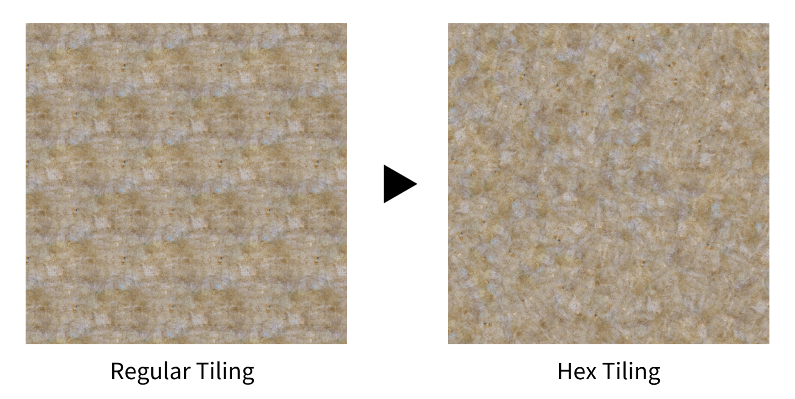

# AviUtl2 Hex-Tiling



[Practical Real-Time Hex-Tiling](https://jcgt.org/published/0011/03/05/) の実装を [AviUtl2](https://spring-fragrance.mints.ne.jp/aviutl/) に移植したものです。  
六角形でタイリングすることでテクスチャの繰り返しや継ぎ目が目立ちにくくなります。

## 動作環境

[AviUtl ExEdit2](https://spring-fragrance.mints.ne.jp/aviutl/)

- `beta34` で動作確認済み。

## インストール

[Releases](https://github.com/azurite581/AviUtl2-Hex-Tiling/releases/latest) から `Hex-Tiling_v{version}.au2pkg.zip` をダウンロードし、AviUtl2 のプレビューにドラッグ&ドロップしてください。

デフォルトでは `加工` カテゴリに配置されます。

## 使い方

1. `加工` カテゴリから `Hex-Tiling` を適用します。
2. ファイル選択ダイアログからサンプリング元となる画像を選択します（ファイル未選択の状態では適用元のオブジェクトからサンプリングします）。

## パラメーター

### タイル設定

- #### サイズ

  タイル全体のサイズ。初期値は `100` です。

- #### タイルサイズ

  タイル 1 つあたりのサイズ。初期値は `100` です。

- #### 回転強度

  タイルの回転強度。初期値は `0` です。

- #### コントラスト補正

  タイルのつなぎ目をブレンドする際のコントラストを補正するための係数。初期値は `75` です。  
  `65` ～ `75` あたりにするのが良いそうです。`50` で無効になります。

- #### 画像ファイル

  サンプリング元となる画像。

- #### 重み表示

  チェックを入れるとタイルの重みを表示します。

### PI

パラメーターインジェクション用の入力欄です。以下の形式に沿って値を入力することで、各種パラメーターの値を上書きできます（実際に入力するときは波括弧は不要です）。

```lua
{ size, tile_size, rot_strength, r, show_weights, img_path }
```

|  | 説明 | 型 | 範囲 |
| :--- | :--- | :--- | :--- |
| size | 全体のサイズ | number | 1 以上 |
| tile_size | タイル 1 つあたりのサイズ | number | 1 以上 |
| rot_strength | タイルの回転強度 | number |  |
| r | コントラスト補正係数 | number | [50, 100] |
| show_weights | 重みを表示するかどうか | number または boolean | [0, 1] または false/true |
| img_path | サンプリング元となる画像ファイルへの絶対パス | string |  |

## 使用したツール

### [aulua](https://github.com/karoterra/aviutl2-aulua)

<details>
<summary>MIT License</summary>

```text
MIT License

Copyright (c) 2025 karoterra

Permission is hereby granted, free of charge, to any person obtaining a copy
of this software and associated documentation files (the "Software"), to deal
in the Software without restriction, including without limitation the rights
to use, copy, modify, merge, publish, distribute, sublicense, and/or sell
copies of the Software, and to permit persons to whom the Software is
furnished to do so, subject to the following conditions:

The above copyright notice and this permission notice shall be included in all
copies or substantial portions of the Software.

THE SOFTWARE IS PROVIDED "AS IS", WITHOUT WARRANTY OF ANY KIND, EXPRESS OR
IMPLIED, INCLUDING BUT NOT LIMITED TO THE WARRANTIES OF MERCHANTABILITY,
FITNESS FOR A PARTICULAR PURPOSE AND NONINFRINGEMENT. IN NO EVENT SHALL THE
AUTHORS OR COPYRIGHT HOLDERS BE LIABLE FOR ANY CLAIM, DAMAGES OR OTHER
LIABILITY, WHETHER IN AN ACTION OF CONTRACT, TORT OR OTHERWISE, ARISING FROM,
OUT OF OR IN CONNECTION WITH THE SOFTWARE OR THE USE OR OTHER DEALINGS IN THE
SOFTWARE.
```

</details>

### [aviutl2-cli](https://github.com/sevenc-nanashi/aviutl2-cli)

<details>
<summary>MIT License</summary>

```text
MIT License

Copyright (c) 2026 Nanashi. <sevenc7c.com>

Permission is hereby granted, free of charge, to any person obtaining a copy
of this software and associated documentation files (the "Software"), to deal
in the Software without restriction, including without limitation the rights
to use, copy, modify, merge, publish, distribute, sublicense, and/or sell
copies of the Software, and to permit persons to whom the Software is
furnished to do so, subject to the following conditions:

The above copyright notice and this permission notice shall be included in all
copies or substantial portions of the Software.

THE SOFTWARE IS PROVIDED "AS IS", WITHOUT WARRANTY OF ANY KIND, EXPRESS OR
IMPLIED, INCLUDING BUT NOT LIMITED TO THE WARRANTIES OF MERCHANTABILITY,
FITNESS FOR A PARTICULAR PURPOSE AND NONINFRINGEMENT. IN NO EVENT SHALL THE
AUTHORS OR COPYRIGHT HOLDERS BE LIABLE FOR ANY CLAIM, DAMAGES OR OTHER
LIABILITY, WHETHER IN AN ACTION OF CONTRACT, TORT OR OTHERWISE, ARISING FROM,
OUT OF OR IN CONNECTION WITH THE SOFTWARE OR THE USE OR OTHER DEALINGS IN THE
SOFTWARE.
```

</details>

## ライセンス

[Practical Real-Time Hex-Tiling](https://jcgt.org/published/0011/03/05/) の実装（主に HLSL シェーダー部分）はオリジナルに基づき、 MIT License で提供されます（ライセンス全文は HLSL ファイルに記載）。

それ以外の部分は [MIT No Attribution License (MIT-0)](LICENSE.txt) に基づくものとします。

## 更新履歴

[CHANGELOG](CHANGELOG.md) を参照してください。
